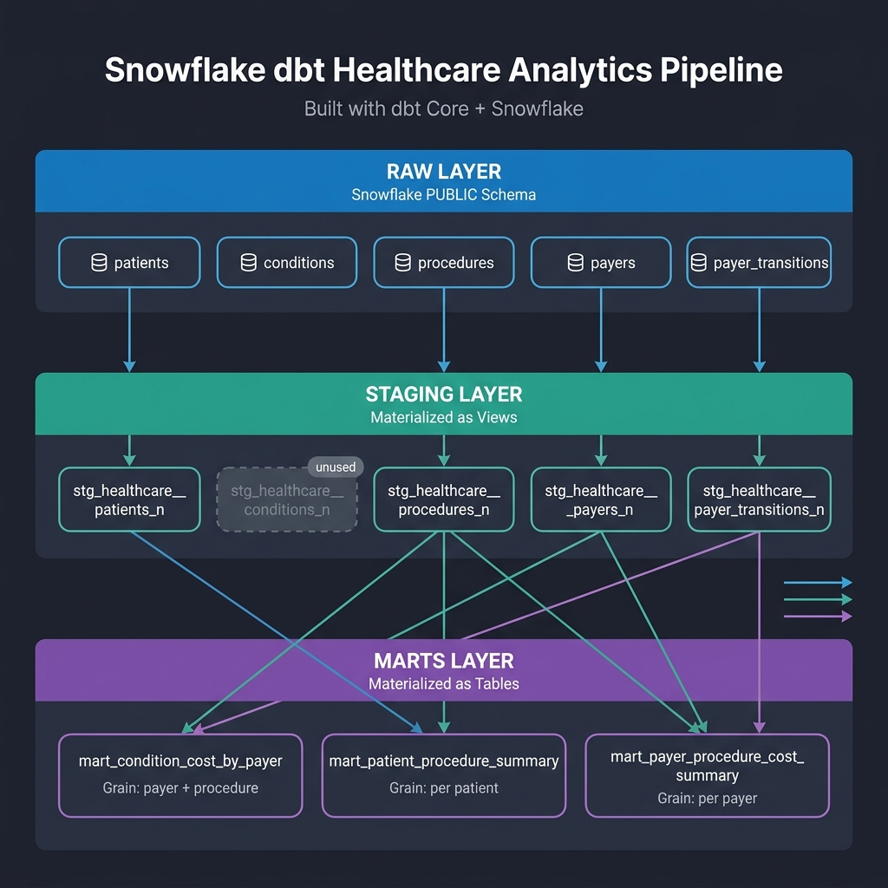

# Snowflake & dbt Healthcare Analytics Pipeline

> **Built with dbt Core + Snowflake | Powered by Antigravity AI**

This repository contains a modern **dbt (Data Build Tool)** analytics engineering project integrated with **Snowflake**. The pipeline processes raw patient clinical data, insurance records, and medical procedures to generate clean, highly-optimized analytical tables for Business Intelligence (BI) and reporting.

---

## 🏗️ Architecture



The pipeline implements a clean, decoupled **three-layer architecture** across separate Snowflake schemas to guarantee data quality, maintainability, and performance.

### Data Lineage

| Mart Model | Staging Dependencies |
| :--- | :--- |
| `mart_condition_cost_by_payer` | `stg_procedures_n` → `stg_payer_transitions_n` → `stg_payers_n` |
| `mart_patient_procedure_summary` | `stg_patients_n` → `stg_procedures_n` |
| `mart_payer_procedure_cost_summary` | `stg_procedures_n` → `stg_payer_transitions_n` → `stg_payers_n` |

> **Note:** `stg_healthcare__conditions_n` is staged but not yet consumed by any mart model. It is available for future analytics use cases (e.g., condition-based cohort analysis).

| Layer | Schema | Materialization | Purpose |
| :--- | :--- | :--- | :--- |
| **Raw** | `PUBLIC` | Source Tables | Raw CSV data loaded into Snowflake |
| **Staging** | `STAGING` | Views | Casting, cleaning, renaming |
| **Marts** | `MARTS` | Tables | Business aggregations for BI |

---

## 📁 Project Structure

```
dbt_project/
├── models/
│   ├── staging/
│   │   ├── healthcare_sources.yml          # Source declarations
│   │   ├── healthcare_schema.yml           # Staging model tests
│   │   ├── stg_healthcare__patients_n.sql
│   │   ├── stg_healthcare__conditions_n.sql
│   │   ├── stg_healthcare__procedures_n.sql
│   │   ├── stg_healthcare__payers_n.sql
│   │   └── stg_healthcare__payer_transitions_n.sql
│   └── marts/
│       ├── schema.yml                      # Mart model tests
│       ├── mart_condition_cost_by_payer.sql
│       ├── mart_patient_procedure_summary.sql
│       └── mart_payer_procedure_cost_summary.sql
├── dbt_project.yml
├── profiles.yml
└── architecture.png
```

---

## 📊 Data Models

### Staging Layer (`models/staging/`)
* **Materialization:** `view`
* **Role:** Acts as the clean ingestion gateway. References raw tables via `{{ source() }}`, enforces strict Snowflake type casting (dates, integers, decimals), standardizes naming conventions, and handles null values.

| Model | Description |
| :--- | :--- |
| `stg_healthcare__patients_n` | Patient demographics — ID, name, gender, city, state, healthcare costs |
| `stg_healthcare__conditions_n` | Diagnoses and conditions per patient encounter |
| `stg_healthcare__procedures_n` | Medical procedures performed — code, description, date, cost |
| `stg_healthcare__payers_n` | Insurance provider reference data |
| `stg_healthcare__payer_transitions_n` | Patient insurance enrollment history over time |

### Marts Layer (`models/marts/`)
* **Materialization:** `table`
* **Role:** Aggregates staging views into indexed, reporting-ready business tables.

| Model | Grain | Description |
| :--- | :--- | :--- |
| `mart_condition_cost_by_payer` | One row per payer + procedure | Total and average procedure cost by insurance payer and procedure type |
| `mart_patient_procedure_summary` | One row per patient | Total procedures, total cost, and average cost per individual patient |
| `mart_payer_procedure_cost_summary` | One row per payer | Aggregated procedure volume and cost metrics grouped by insurance provider |

---

## 🛠️ Getting Started

### Prerequisites
* **Python 3.8+**
* **dbt-core & dbt-snowflake** — `pip install dbt-snowflake`

### Setup Instructions

1. **Clone the repository:**
   ```bash
   git clone https://github.com/shashidharsd5046/snowflake_dbt_healthcare_project.git
   cd snowflake_dbt_healthcare_project
   ```

2. **Configure Environment Variables:**
   Create a `.env` file in the root of the project:
   ```env
   DBT_SNOWFLAKE_PASSWORD="your_snowflake_password_here"
   ```

3. **Verify Connection:**
   ```bash
   export $(cat .env | xargs)
   dbt debug
   ```

---

## 🚀 Running the Pipeline

```bash
# Load credentials
export $(cat .env | xargs)

# Build all models and run all tests (recommended)
dbt build

# Build only a specific model
dbt build --select mart_payer_procedure_cost_summary

# Run all models
dbt run

# Run all tests
dbt test

# Store failing test rows in Snowflake for debugging
dbt test --store-failures

# Preview results of any model
dbt show --limit 10 --inline "select * from {{ ref('mart_payer_procedure_cost_summary') }}"
```

---

## 🧪 Data Quality Tests

This project enforces strict data quality using dbt's built-in schema assertions across all layers:

| Test | Applied To |
| :--- | :--- |
| `unique` | `patient_id`, `payer_id` |
| `not_null` | All primary keys, metric columns, required dimensions |

Total tests across the project: **32 data tests**

---

## ☁️ Snowflake Connection Details

| Property | Value |
| :--- | :--- |
| Account | `PGVOJHP-AD84474` |
| Warehouse | `COMPUTE_WH` |
| Database | `HEALTHCARE_DATE` |
| Role | `ACCOUNTADMIN` |
| Threads | `4` |
